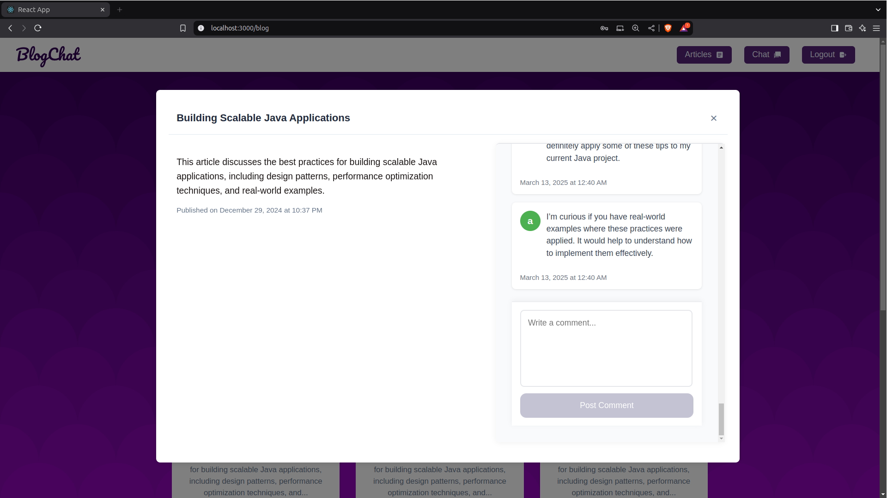

# Blog Application with Real-Time Chat 📝💬

## Overview 🌟

This application is a blog platform where users can read and comment on articles. Additionally, it features a real-time chat functionality that allows users to communicate with each other instantly. The app also supports user management, enabling users to sign up, log in, and log out. 🚀

This repository contains only the **frontend** of the application. 
The backend can be found [here](https://github.com/AzioizAnass/chat-application-backend).
Please make sure to run the backend first by following the instructions in the backend repository.

### Features:
- **Articles**: Users can browse a list of blog posts and read them in detail. 📖
- **Comments**: Users can leave comments on the articles. 💬
- **Real-Time Chat**: Users can chat with each other in real-time within the app. 🗨️
- **User Management**: Sign up, login, and logout functionalities are available. 🔑

## Prerequisites 📋
- Make sure to clone and run the backend repository first. Follow the [backend README](https://github.com/AzioizAnass/chat-application-backend) for instructions on setting up and running the backend.
- Install **Node.js** and **npm** to run the frontend application.

## Screenshots 📸

### 1. Sign In

### 2. Sign Up

### 3. Articles

### 4. Article

### 5. Chat Feature

The chat feature allows users to communicate with each other in real-time. The screen is split into two sections where two users can exchange messages seamlessly. 👥💬

## Installation 🛠️

1. Clone the repository:
   git clone https://github.com/AzioizAnass/blog-chat-client.git

2. Install dependencies:
   npm install

3. Run the frontend application:
   npm start

## Technologies Used 🧰
   Frontend: TypeScript, React JS ⚛️, Tailwind CSS 🌿
   Backend: Spring Boot 🚀 (see the backend repository)
   Real-Time Communication: WebSockets /
   Authentication: JWT (JSON Web Token) 🔒

## Acknowledgments 🙏
Inspired by various modern web applications 💡
Built using TypeScript, React JS, and Tailwind CSS 🌍
